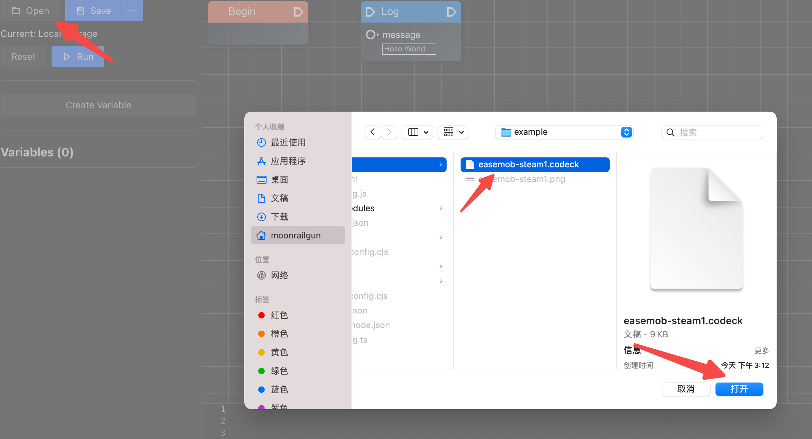
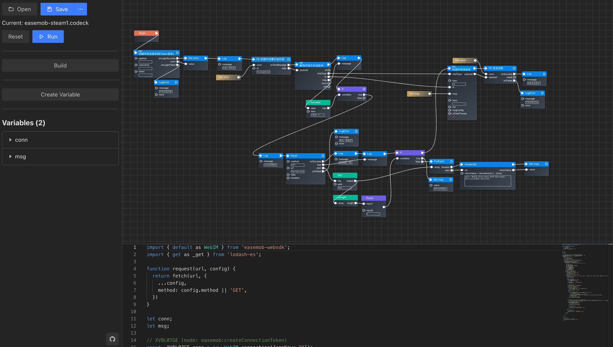

# 作品说明

本文件夹下内容为参加环信超级社区比赛而上传的项目。

作品包含两个项目:

- codeck 可视化编程引擎
- steam 喜加一查询机器人

其中 `codeck` 是底层应用，不包含任何业务实现。`steam 喜加一查询机器人`是基于`codeck`制作出的业务实现。如果想要实现类似的功能，只需要简单的拖拽与编辑，非专业人事也能设计出自己的类似实现。

## How to use

首先运行 codeck

```bash
cd codeck
pnpm install
pnpm dev
```

在打开的界面中选择`steam喜加一机器人`加载脚本



打开后会加载如下内容:



找到创建环信连接实例，修改相关参数为一个独立的账号(模拟用户正常登录)

输入完毕后，点击左侧运行(Run)或构建(Build)。

> 注意因为用的是web api所以不能构建为node应用, 如果需要构建请选择 web / esmodule.

运行提示机器人正在监听后，在任意机器人账号加入过的房间中输入"喜加一"

机器人会访问网络请求获取当前支持的 "Steam 喜加一" 游戏列表


## 关于开源协议

特别的，因 `codeck` 原始项目设计基于 `Apache - 2.0` 开源协议进行开源，但由于本项目相关比赛内容，提交到本项目的源代码会以 MIT 协议进行开源

原始项目与开源协议相关请查询: [https://github.com/moonrailgun/codeck](https://github.com/moonrailgun/codeck)
