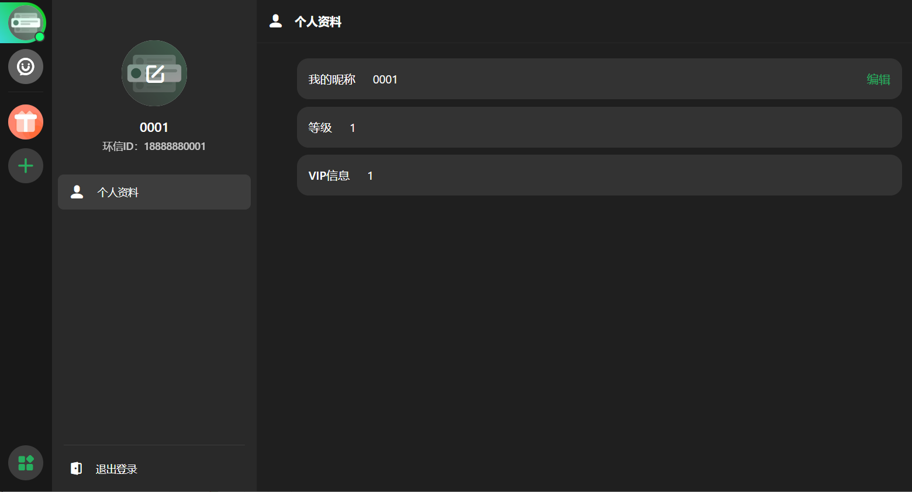
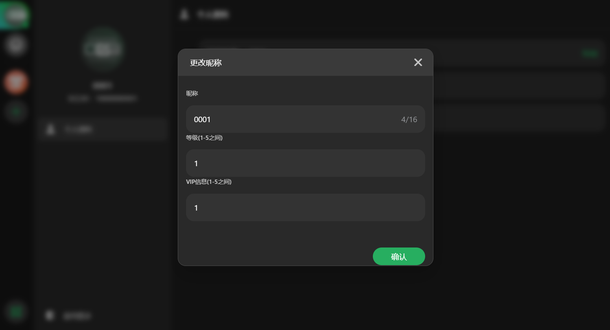
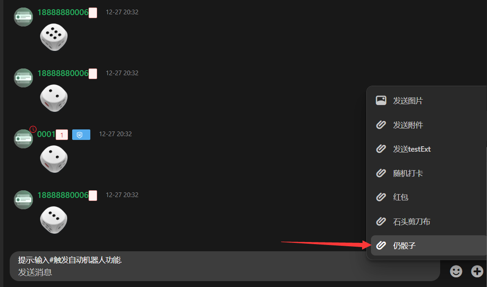
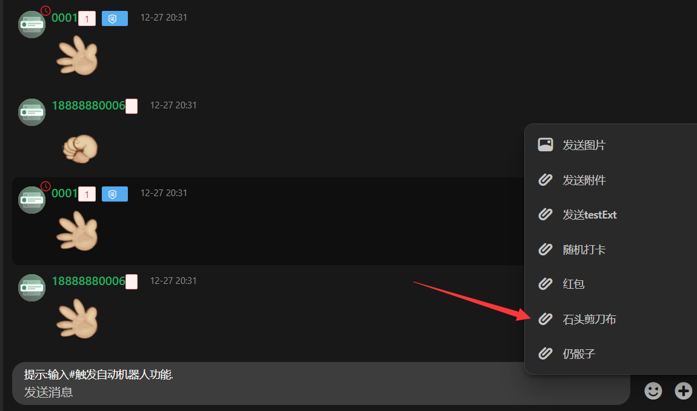
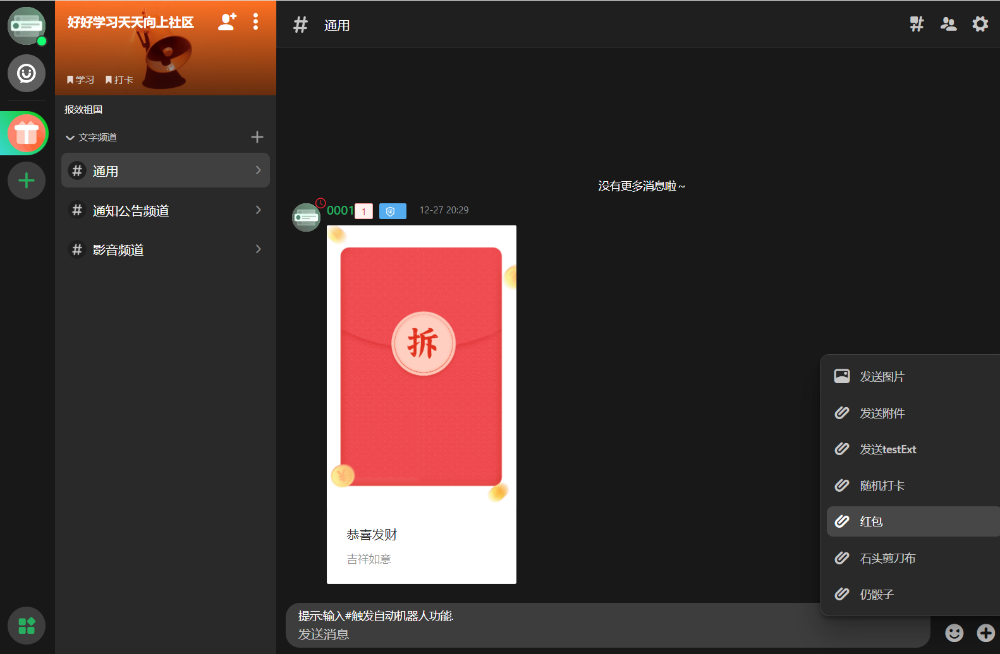
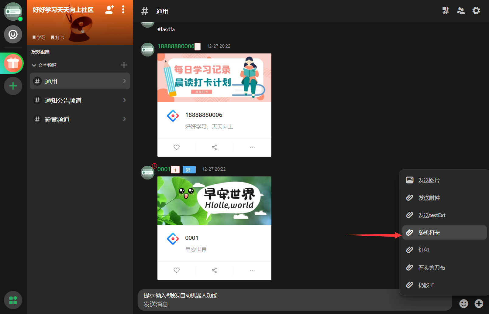
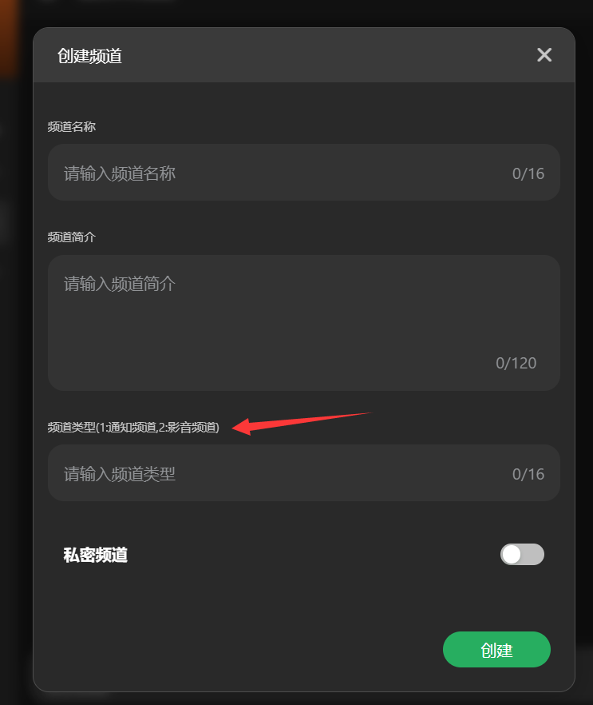
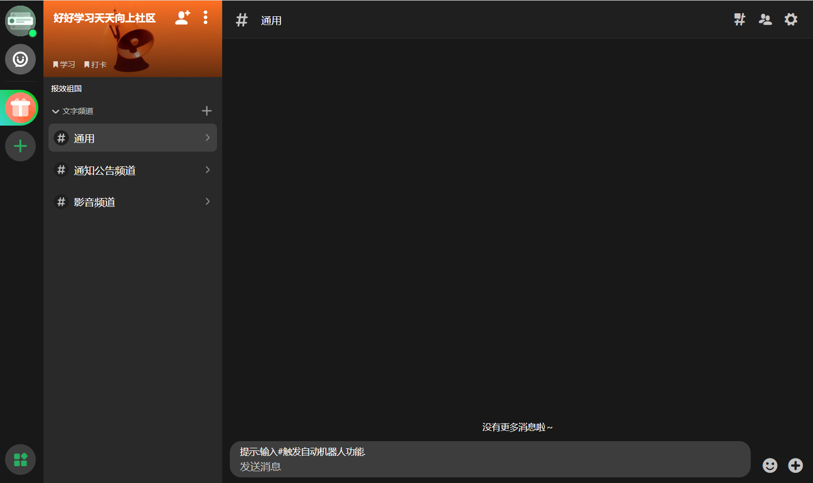
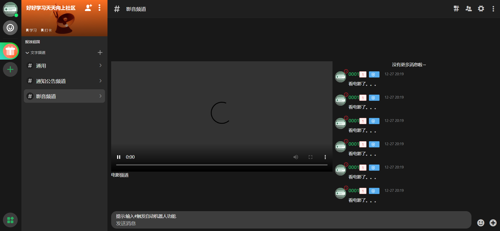
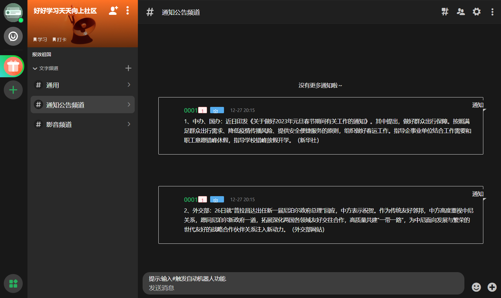

# 环信Discord场景创意编程大赛 参赛作品 web端

## 简介

使用环信超级社区（Circle） IM Web SDK 实现一些有趣的功能。

[在线体验地址：http://121.37.25.228:8088/](http://121.37.25.228:8088/)

账号可以使用下边的，也可以自己注册（进去后可以修改用户的等级权限） 

```bash
18888880001
18888880002
18888880003
18888880004
18888880005
18888880006
```

## 运行项目

1、克隆项目  
```bash
git clone https://github.com/easemob/Circle-Demo-Web.git
```

2、安装依赖
```bash
npm install
```

3、设置appKey
在"/src/utils/WebIM.js"文件中设置你的appKey。

4、运行项目

```bash
npm start
```
## 反馈
如果你有任何问题或建议，可以通过 issue 的形式反馈。

## 项目介绍

### 个人资料权限修改，等级，vip信息，主要用于在聊天界面显示不同等级图标，vip图标





### 扔骰子 游戏



### 石头剪刀布 游戏



### 一个简单的红包 功能



### 随机打卡 功能



### 可以建立三个不同类型的频道  

创建频道信息





电影频道  



通知公告频道



### 机器人功能

可以通过 #关键字 触发这个功能

## 感谢华为云服务器支持 

[华为云](https://www.huaweicloud.com/)

## 参考文档

产品概述及开发文档：
https://docs-im.easemob.com/ccim/circle/overview

## 代码许可
示例项目遵守 MIT 许可证。

