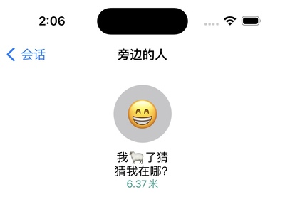

# 小黄鱼

  

小黄鱼是一款聚焦近距离兴趣交流的社交app，支持在无互联网连接、大人流量集中、地铁、火车、高铁等场景与周围的黄鱼er互动。

## Screenshots

## Feature List

- 根据设备指纹自动生成账号
- 官方维护 `北京地铁` 和 `上海地铁` 社群
- 支持搜索 `已加入社群` `网络社群` 已经 `附近的社群`
- 支持与附近的小黄鱼用户互动
- 支持在无互联网连接的情况下发送IM消息

## Metro

小黄鱼官方会根据地铁数据为每个城市建立社群，然后为每条线路创建对应的频道，你可以加入自己常坐线路的频道实时了解地铁信息，或者与同车乘客讨论一下今天的天气？

## 无网络IM

通常在地铁高铁飞机或者其他大人流场所网络会特别差或者完全没有网络。这个时候你可以打开小黄鱼和附近的聊一聊今天晚上吃什么？

## Surprise 😁

## License

此项目为[环信Discord场景创意编程大赛](https://www.easemob.com/event/discord)参赛作品的源代码以MIT开源协议对外开源。详情请查看[LICENSE文件](./LICENSCE)了解详情。
